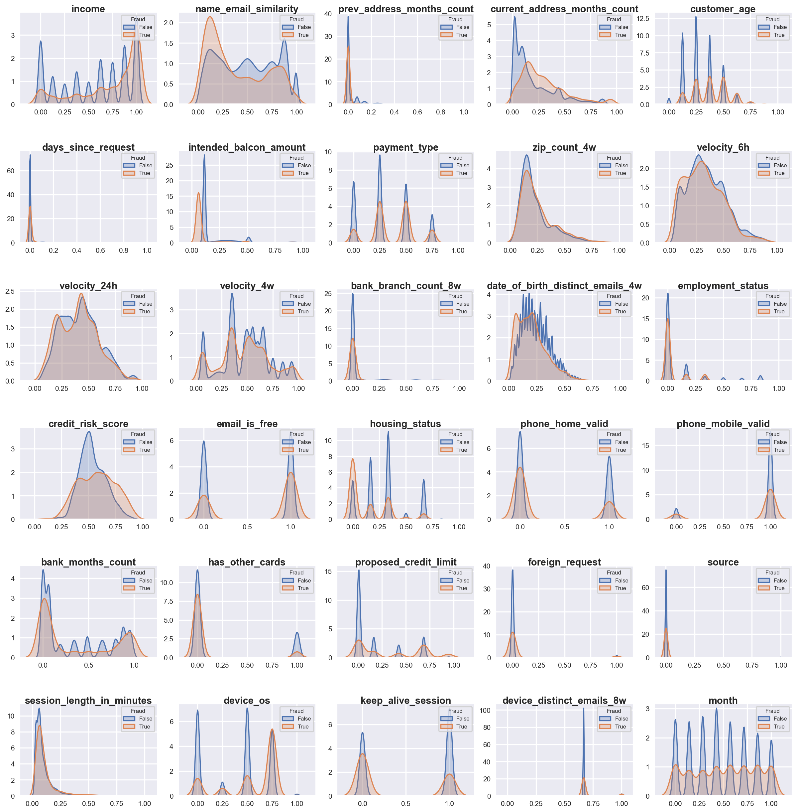

# Improving Fraud Detection with 1D-Convolutional Spiking Neural Networks through Bayesian Optimization

[](https://doi.org/10.5281/zenodo.12628435)

Source code of the paper accepted at [EPIA 2024](https://epia2024.pt/), the 23rd International Conference on Artificial Intelligence.

## Paper Abstract
The digitalization of the banking sector has enabled an increasing number of fraudulent activities in the past years. The development of new practical solutions for fraud detection is particularly challenging since the industry needs to respect a 5\% threshold of false detection of fraud, avoiding monetary losses. The usage of traditional machine learning algorithms faces other challenges, such as classification discrimination and high energy consumption. Spiking Neural Networks, designed to mimic the brain's natural processes, present a compelling alternative. Particularly on neuromorphic hardware, they exhibit remarkable energy efficiency, paving the way for the advancement of sustainable Artificial Intelligence.
Our approach consists of applying 1D-Convolutional Spiking Neural Networks to improve fraud detection on the Bank Account Fraud dataset with the Bayesian optimization of hyperparameters. As a result, we show that these architectures can solve the problem of biased data while maintaining algorithm performance when compared against more traditional approaches such as Gradient Boosting models. Moreover, we lay out the Bayesian optimization process for the hyperparameters, thereby enhancing the performance of these algorithms.

**Keywords:**
Spiking Neural Networks $\cdot$ 
1D-Convolution $\cdot$
Bayesian Optimization $\cdot$
Fraud Detection $\cdot$
Neuromorphic Computing $\cdot$
Fairness 

## Installation

To install the required packages, run the following command:
```bash
pip install -r requirements.txt
```

Download Base Variant of the [Bank Account Fraud (BAF) Dataset](https://www.kaggle.com/datasets/sgpjesus/bank-account-fraud-dataset-neurips-2022) and extract the parquet files to the [`data`](./data/README.md) folder.

## Dataset

The Bank Account Fraud (BAF) dataset is a synthetic dataset based on real-world data that simulates the applications for bank account opening. The dataset contains 6 parquet files, each representing a different variant of the dataset (only Base variant is used in this work). The dataset contains 30 features and a binary target variable indicating whether the application is fraudulent or not.



## Repository Structure

The repository is structured as follows:

- [`data`](./data/README.md): Contains the Bank Account Fraud dataset.
- [`images`](./images): Contains the images used in this README file.
- [`src`](./src): Contains the source code of the project.
    - [`modules`](./modules): Contains the utilitary files used in the project.
    - [`get_best_config.ipynb`](./src/get_best_config.ipynb): Jupyter notebook to find the best configurations for each 1D-Convolutional Spiking Neural Network architectures.
    - [`get_best_hyperparams.ipynb`](./src/get_best_hyperparams.ipynb): Jupyter notebook to find the best combinations of hyperparameters/configuration for each 1D-Convolutional Spiking Neural Network architectures.
    - [`main.py`](./src/main.py): Main script to run the Bayesian Optimization of the 1D-Convolutional Spiking Neural Network architectures and configurations.
    - [`plot_pareto_front.ipynb`](./src/plot_pareto_front.ipynb): Jupyter notebook to plot the Pareto front of the optimized configurations.
    - [`plot_syringeplot.ipynb`](./src/plot_syringeplot.ipynb): Jupyter notebook to plot the syringeplot of the optimized configurations.


## Bibtex

To cite this work, use the following bibtex entry:

```bibtex
TBD
```

